# Lesson 06: Advanced mapping techniques with CartoDB.js

This lesson explores the JavaScript library supporting the CartoDB platform, [CartoDB.js](http://docs.cartodb.com/cartodb-platform/cartodb-js/), which expands the potential of CartoDB's web editor for creating customized web maps. The lesson introduces the [API documentation](http://docs.cartodb.com/cartodb-platform/cartodb-js/api-methods/) and demonstrates various techniques for requesting data from a personal account on CartoDB to render a map in the browser.

## Introduction to CartoDB

Like [Mapbox](https://www.mapbox.com/), CartoDB is an emerging company seizing recent advancements in open source web standards. Their state-of-the-art geospatial tools allowing us to better capture, store, analyze, represent, and share geographic information in the form of maps.

CartoDB's growing body of documentation, tutorials, and examples is quite excellent, and you should take some time to peruse these resources. A good point of entry is [Getting Started with CartoDB](http://docs.cartodb.com/cartodb-platform/cartodb-js/getting-started/).

Their [Map Academy](http://academy.cartodb.com/) offers great tutorials ranging from beginning to more advanced.

The [CartoDB codebase is also hosted on GitHub](https://github.com/CartoDB), and you can view the code in many [examples](https://github.com/CartoDB/cartodb.js/blob/develop/examples).

You may also wish to [follow CartoDB on Twitter](https://twitter.com/cartoDB), where they often announce free webinars you can access online.

Finally, another good resource for fun examples using CartoDB are the small Gist examples written by one of CartoDB's main JavaScript developers, Javier Santana. These can be viewed as "Blocks": [javi santana’s Blocks](http://bl.ocks.org/javisantana).

This lesson will walk us through several example scripts to get a sense of how CartoDB.js works. Let's start with a basic template to get us going (provided within your *lesson-06-data/* directory).

## Getting started with CartoDB.js

To make use of the CartoDB.js methods explored within this lesson, you'll first need a dataset and map hosted on CartoDB through your account. For my examples, I'm using a map  of uninsured US adults by county for the year 2015, created for examples used in [Module 08 of MAP671](http://newmapsplus.uky.edu/map671-module-08-integrating-qgis-cartodb).

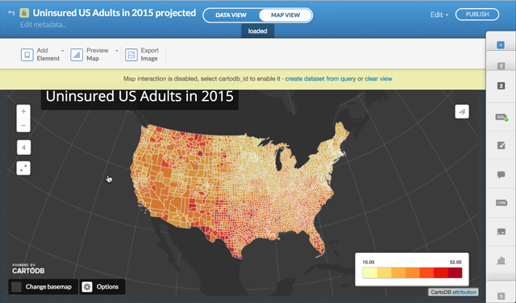  
**Figure 01**. CartoDB hosted map of uninsured US adults by county for the year 2015.

Note that the map consists of three layers atop a dark grey background (or base layer, in CartoDB speak), and does not use a tiled base map. The bottom layer is a 20 degree graticule, and above that is a polygon of the N. American landmass (both clipped and generated as GeoJSON files from QGIS). The US counties layer sit atop those. These are all ordered and styled using CartoCSS within the CartoDB web editor.

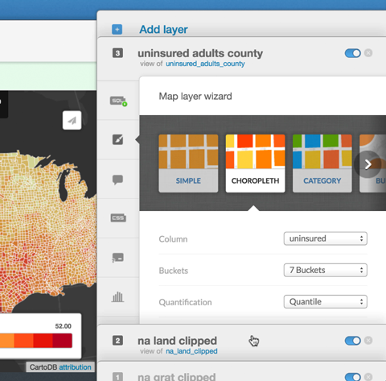  
**Figure 02**. Layers managed through the CartoDB web editor

Also noteworthy is that this map has been projected to a Albers Equal Area projection using the powerful PostGIS functionality provided by CartoDB. Using a custom SQL query, we are able to transform the default coordinates of theses layers from the webmercator projection into others. See the blog post, [Free Your Maps From Web Mercator](http://blog.cartodb.com/free-your-maps-web-mercator/).

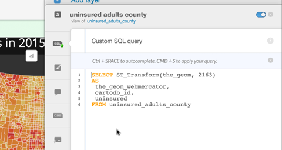  
**Figure 03**. An SQL query transforming the layer coordinates into Albers Equal Area.

Finally, recall how that within the CartoDB web editor we can style and edit the styles for the look and feel of the vector geometries through the CartoCSS editor. The style rules here were generated automatically by CartoDB's "Map Wizard" using one of the available classification methods (quantile, equal interval, etc).

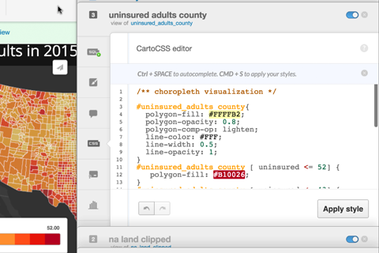  
**Figure 04**. CartoCSS rules for styling a choropleth map in CartoDB.

You don't need this exact map set up in your account to proceed through this lesson's examples and demonstrations. If you don't have a similar choropleth map already created in CartoDB's editor, feel free to quickly load the files provided within the *lesson-06-data/* directory (*na_grat_clipped.geojson*, *na_land_clipped.geojson*, *uninsured_adults_county.geojson*).

## Starting with a CartoDB template

We'll want to first explore the [CartoDB.js library and documentation](http://docs.cartodb.com/cartodb-platform/cartodb-js/).

Begin by opening the *index-starter-template.html* file within the *lesson-06-data/* directory. The basic structure of this document should look familiar to you. Within the head of the document there is a link loading a *cartodb.css* CSS style sheet from CartoDB's CDN. Custom styles we may write follow this between the `<style></style>` tags.

Within the `<body></body>` tags we see the familiar `<div id="map"></div>`, the HTML element where our map will be loaded.

Typically we've seen our JavaScript libraries loaded within the head of the document as well. However, it's not a bad practice to load these toward the bottom of the document, directly above where we write our own custom JavaScript between the `<script></script>` tags. 

Within this template we see the request for the `cartodb.js` library: `    <script src="http://libs.cartocdn.com/cartodb.js/v3/3.15/cartodb.js"></script>`. 

```html
<!DOCTYPE html>
<html>
<head>
    <title>673 Module 06 CartoDB Starter Template</title>
    <meta name="viewport" content="initial-scale=1.0, user-scalable=no" />
    <meta http-equiv="content-type" content="text/html; charset=UTF-8"/>
    
        <link rel="stylesheet" href="http://libs.cartocdn.com/cartodb.js/v3/3.15/themes/css/cartodb.css" />
        
    <style>
      html, body, #map {
        height: 100%;
        padding: 0;
        margin: 0;
      }
    </style>


</head>
<body>
    
    <div id="map"></div>

    <script src="http://libs.cartocdn.com/cartodb.js/v3/3.15/cartodb.js"></script>
    <script>
        
    </script>
</body>
</html>
```  
**Code Bank 01**. Starter Template for CartoDB map.

Note that the Leaflet JavaScript library comes conveniently bundled within this code, as well as JQuery.js. So no need to load those resources separately! Load this file in your browser (i.e., using Brackets' Live Preview) and ensure there are no errors in the console before continuing.

## Using the CartoDB.js createVis method

We first want to look within the [API Methods](http://docs.cartodb.com/cartodb-platform/cartodb-js/api-methods/). The most simple way to use CartoDB is using the [`cartodb.createVis()` method](http://docs.cartodb.com/cartodb-platform/cartodb-js/api-methods/#cartodbcreatevis).

Within the CartoDB web editor, if I go to PUBLISH (top right corner of the page), there are three options: one to "Get the link", another to "Embed it", and another that says "CartoDB.js", which is intended to "Add your map to your applications by using this URL." We want to use this third option. Copy that URL and return to your script.

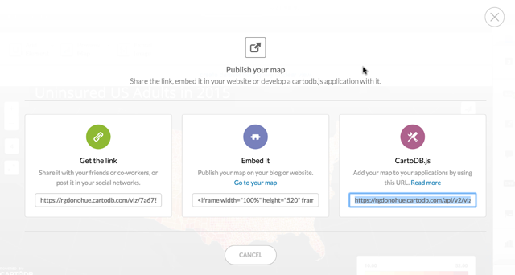  
**Figure 05**. Grabbing the URL to the map within the CartoDB Publishing window.

Paste the url into your script as a string (surrounded by quotation marks), and assign it to a variable. For example:

```javascript
var url = 'https://rgdonohue.cartodb.com/api/v2/viz/7a678fd6-88a7-11e5-8ee8-0e674067d321/viz.json';
```
**Code Bank 02**. Assigning the CartoDB viz URL to a JS variable.

The URL comprises my user name (`rgdonohue`), my API key (`7a678fd6-88a7-11e5-8ee8-0e674067d321`), and ends with a JSON file named `viz.json`. You'll want to use your username and API key.

Within the API documentation on the the [`cartodb.createVis()` method](http://docs.cartodb.com/cartodb-platform/cartodb-js/api-methods/#cartodbcreatevis), examine the example code at the bottom of the method's documentation. We'll start with this basic example. Paste this into your script, and then replace the URL string with the one copied from your visualization. We'll include a `console.log()` statement  as well, to see what the values of these two parameters are passed within the `.done()` methods callback function.

```javascript
var url = 'http://documentation.cartodb.com/api/v2/viz/2b13c956-e7c1-11e2-806b-5404a6a683d5/viz.json';

cartodb.createVis('map', url)
  .done(function(vis, layers) {
      console.log(vis, layers)
  });
```
**Code Bank 03**. Creating a map using the `createVis` method.

We see that the `createVis()` method passed two arguments: one a reference to our map object (very similar to Leaflet) and the second the URL string of our specific CartoDB visualization. Testing this page now in your browser, the result is a rendered map that looks just as grabbing the link from CartoDB and serving the map (i.e., vis). 

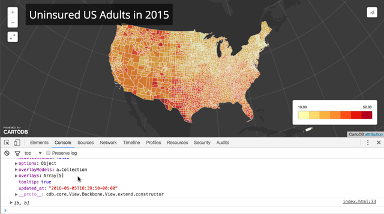  
**Figure 06**. A map created at the local level using the createVis method.

Here we can also examine what the `vis` and `layers` parameters are references within the Console. The first is a complicated CartoDB/Leaflet object. The second is an array consisting of two objects (more on this second one below).

### Digging into the createVis method options.

CartoDB.js allows us to gain some control over how this simple map visualization appears within the browser. We can begin to customize this a bit more by exploring some of the options available listed within this method API reference. Try entering in some of the options (one at a time) and changing the values to see the output in the rendered map.

```javascript
cartodb.createVis('map', url, {
    shareable: false, // removes the share link upper right of map
    title: true, // adds better title banner across the top,
    description: false,
    search: true, // doesn't work well when map has been projected
    zoom: 4, // sets initial zoom level
    cartodb_logo: false,
    layer_selector: true,
    fullscreen: false
})
```  
**Code Bank 04**. Playing with `createVis` method options.

Also note that we could select some of these elements ourselves using CSS and modify the look and feel of this map beyond what CartoDB's default styles provide. To do so, you may need to use the Element inspector of your web developer toolbar to see the specific class attribute names CartoDB uses when rendering the document.

We won't spend a lot of time in this particular method, but let's dive a little deeper and explore what's passed and made available within that `done` event callback function: the `vis` and the `layers`.

We noted above that the second parameter of the `.done()` method's callback function (written as `layers`). This references an array consisting of two objects (or "layers" in CartoDB speak). The first is the CartoDB base layer (i.e., the tiled base map, if we had one, or simply that dark base color I added in the CartoDB web editor). The second will give us access the actual vector layers being drawn.

We can gain access to these layers through the second object (e.g., `layers`) within this array (e.g., `var sublayer = layers[1];`). From there, we can play with various CartoDB methods to achieve different objectives. Consider playing with the following statements:

```javascript
cartodb.createVis('map', url)
    .done(function(vis, layers) {

        console.log(vis, layers);
        console.log(vis.getLayers()); /// same as layers here
        console.log(vis.getOverlays()); /// same as layers here
    
        var sublayer = layers[1]; // reference to the layers
    
        console.log(layers[1].getSubLayerCount()) // the number of layers
    
        sublayer.setInteraction(true); // set the interaction true on the layers
    
        // retrieve specific information from various features of the layers
        sublayer.on('featureOver', function(e, latlng, pos, data) {
            console.log(e, latlng, pos, data);
        });
    
        sublayer.setOpacity(.5); // change the opacity of the layers
    
        sublayer.getSubLayer(2).hide();  // select a specific sublayer of the
                                            // layers and hide it
});
```  
**Code Bank 05**. Exploring the layers, sublayers, and sublayer methods.

Before we move on to a more powerful way of interacting with CartoDB, note that through that first parameter of the `.done()` method (written as `vis` here), we can also gain access to the Leaflet map itself. 

```javascript
cartodb.createVis('map', url)
    .done(function(vis, layers) {
         var map = vis.getNativeMap(); // returns reference to the Leaflet map instance
});
```  
**Code Bank 06**. Accessing the native (Leaflet) map element.

With access to that map instance, we could no do other things like add Leaflet overlays in use Leaflet plugins with the visualization.

## Using the CartoDB createLayer method

Much more powerful is CartoDB.js's [`createLayer()` method](http://docs.cartodb.com/cartodb-platform/cartodb-js/api-methods/#cartodbcreatelayer). We'll spend the rest of the time exploring what we can do with this method, rather than the `createVis()` method. Also, read CartoDB's lesson on [createVis vs. createLayer](http://academy.cartodb.com/courses/cartodbjs-ground-up/createvis-vs-createlayer/).

One of the main differences between the `createLayer()` method and the `createVis()` method is that we first need to instantiate a Leaflet map object within which the map will be created.

The simplest way to do this is to instantiate the map object, and then call the method, passing a reference to the `viz.json` object of our CartoDB map (obtained from within the web interface, as we did above in script 03 and script 04). In this example, note that the center coordinates of the map are not centered on the middle of N America, but rather have been adjusted due to the PostGIS projection being implemented on the map. Those need to modified in relation to lat/lng being closer to 0/0. These will likely need adjustment depending upon the geography you're mapping and the projection you're using.

```javascript
// instantiate our map
var map = new L.Map("map", {
    center: [-10,5],  // note the map is centered closer to 0,0
    zoom: 4.5
});

var url: 'https://rgdonohue.cartodb.com/api/v2/viz/7a678fd6-88a7-11e5-8ee8-0e674067d321/viz.json';

cartodb.createLayer(map, url).addTo(map);
```  
**Code Bank 07**. Using the URL to the CartoDB vis object to make a map with `createLayer()` method.

The result looks very similar to our previous map using the `createVis()` method. We notice that the background is a light grey. This is because this method didn't load the base layer (which was the first object in the array of the `layers` parameter of the `.done()` method using the  `createVis()` method above). 

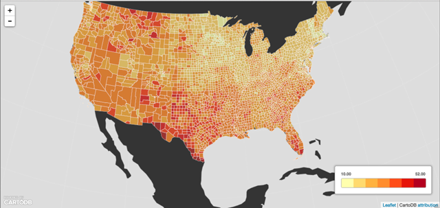  
**Figure 07**. CartoDB map rendered with the createLayer method and a vis.json object.

In this case, we can simply add a CSS background (`#3d3d3d`) color the map div element within our document, and the map will again be identical to the above.

### Using a source object with the CartoDB.js createLayer method

Using the method in this way is just okay, and we can really start to do some cool things when we don't use that URL to the `vis.json`. Instead we want to use a [source object](http://docs.cartodb.com/cartodb-platform/cartodb-js/layer-source-object/).

To do so, we create an object (and assign it to a variable) using the following structure, then pass it to the `createLayer()`. CartoDB.js will then make a request to the server to process that information and return the appropriate map tiles.

```javascript
var sourceObject = {
    user_name: '< your CartoDB user name >',
    type: 'cartodb',
    sublayers: [
        {
            sql: "< sql statement selecting from CartoDB table >",
            cartocss: < string of CartoCSS rules for styling the layer >
        }  
    ]
}

cartodb.createLayer(map, sourceObject).addTo(map);
```  
**Code Bank 08**. Structure of the source object.

We also need those CartoCSS rules for our request to work. From where do we get them? We could write these rules ourselves, referencing the [CartoCSS documentation](http://docs.cartodb.com/cartodb-platform/cartocss/). This can be laborious, however, and it is easier to simply grab the rules generated within the CartoDB web editor. To start, let's just grab the first rule and paste that into our script.

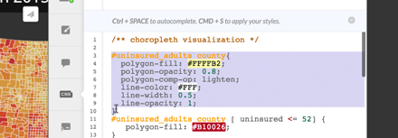  
**Figure 08**. Copying the first rule from the CartoDB editor to paste into the script.

Since the CartoCSS rule is a long, complicated string, we find ways to store it and use more easily. One way is to first a long, concatenated string of the rules to a variable within the JavaScript. So for instance, for my map I can write:

```javascript
// instantiate our map
    var map = new L.Map("map", {
        center: [40,-104],  // note that the coordinates are back to lat/lon
        zoom: 4
    });
        
    var cartoCSS = '#uninsured_adults_county{'+
          'polygon-fill: steelblue;'+
          'polygon-opacity: 0.8;'+
          'polygon-comp-op: lighten;'+
          'line-color: #FFF;'+
          'line-width: 0.5;'+
          'line-opacity: 1;'+
        '}';
        
    var sourceObject = {
        user_name: 'rgdonohue',
        type: 'cartodb',
        sublayers: [
            {
                sql: "SELECT * FROM uninsured_adults_county",
                cartocss: cartoCSS
            }  
        ]
    }
    
    cartodb.createLayer(map, sourceObject).addTo(map);
```  
**Code Bank 09**. Applying CartoCSS rules to the source object with a variable.

Be sure to have modified the lat/lng of the map due to the web mercator projection (see Code Bank 09).

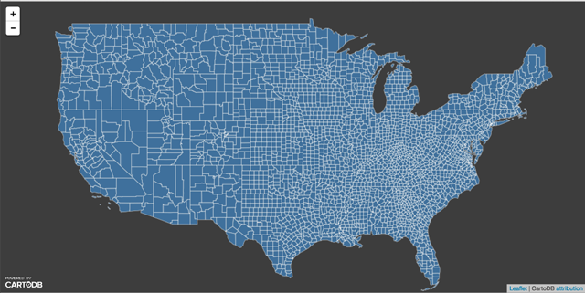  
**Figure 09**. Map rendered using a source object and CartoCSS rules.

### Projecting geometries client-side with SQL queries and PostGIS

We can also project using this client-side script by modifying the SQL statement. Again we can copy our code from the CartoDB web SQL editor and paste it within our source object (you'll also need to re-adjust the center of the map back to `[-10, 0]` for this example). 

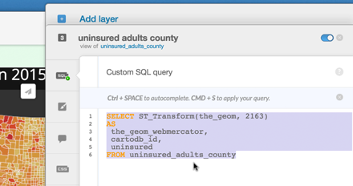  
**Figure 10**. Copying sql code from the CartoDB editor.

These statements can also be stored to variables for legibility, but here we'll simply assign the string the the sql property.

```javascript
sublayers: [
            {
                sql: "SELECT ST_Transform(the_geom, 2163) AS the_geom_webmercator, cartodb_id, uninsured FROM uninsured_adults_county",
                cartocss: $("#counties-styles").text()
            }  
        ]
```  
**Code Bank 10**. Applying a SQL statement to request layer be reprojected from Web Mercator.

This results in a request processed on CartoDB's backend that re-projects the map and serves these as raster tiled images. Note that CartoDB's layers are not rendered as vector features or objects. 

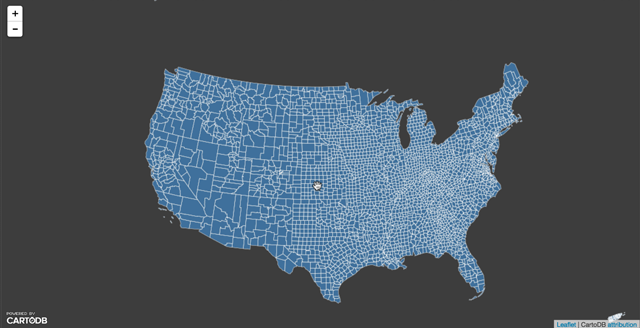  
**Figure 11**. The reprojected map using client-side SQL within a source object.

### Including CartoCSS rules within script element tags

Let's say we wish to include the rest of the CartoCSS rules to recreate the choropleth. While we could include those as concatenated strings along with the current style rule, we can instead include them as a script and reference that within the source object.

Above the opening `<script>` tag for our custom javascript, we can copy our CartoCSS rules from the CartoDB web editor and simply paste them all between two `<script></script>` tags. Note the `type` and id `attribute` values of this script tag.

```javascript
<script type="cartocss/html" id="counties-styles">
        /** choropleth visualization */

        #uninsured_adults_county{
          polygon-fill: #FFFFB2;
          polygon-opacity: 0.8;
          polygon-comp-op: lighten;
          line-color: #FFF;
          line-width: 0.5;
          line-opacity: 1;
        }
        #uninsured_adults_county [ uninsured <= 52] {
           polygon-fill: #B10026;
        }
        #uninsured_adults_county [ uninsured <= 43] {
           polygon-fill: #E31A1C;
        }
        #uninsured_adults_county [ uninsured <= 36] {
           polygon-fill: #FC4E2A;
        }
        #uninsured_adults_county [ uninsured <= 30] {
           polygon-fill: #FD8D3C;
        }
        #uninsured_adults_county [ uninsured <= 23] {
           polygon-fill: #FEB24C;
        }
        #uninsured_adults_county [ uninsured <= 17] {
           polygon-fill: #FED976;
        }
        #uninsured_adults_county [ uninsured <= 10] {
           polygon-fill: #FFFFB2;
        }
</script>
    
<script>
// instantiate our map
```  
**Code Bank 11**. Applying a block of CartoCSS rules within script element tags.

Then, when we write our source object, we can use JQuery to select this script and return the text within it.

```javascript
sublayers: [
            {
                sql: "SELECT ST_Transform(the_geom, 2163) AS the_geom_webmercator, cartodb_id, uninsured FROM uninsured_adults_county",
                cartocss: $("#counties-styles").text()
            }  
        ]
```  
**Code Bank 12**. Selecting the script tags containing the CartoCSS rules and returning their enclosed text.

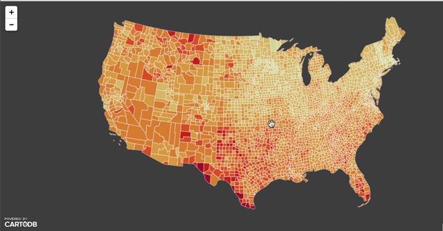  
**Figure 12**. The reprojected choropleth map storing CartoCSS rules within script tags.

### Requesting different layers from CartoDB tables

We can load additional layers (from different tables hosted by CartoDB) by including then with the property `sublayers`  array. We also need to include CartoCSS rules for them.

```javascript
var gratCartoCSS = '#na_grat_clipped{' +
                        'line-color: #ffffff;' +
                        'line-width: 2;' +
                        'line-opacity: 0.1;' +
                    '}'

var landCartoCSS = '#na_land_clipped{' +
                    'polygon-fill: #323232;' +
                        'polygon-opacity: 1;' +
                        'line-color: #FFF;' +
                        'line-width: 0;' +
                        'line-opacity: 1;'+
                    '}'
    
var sourceObject = {
    user_name: 'rgdonohue',
    type: 'cartodb',
    sublayers: [
        {
        sql: "SELECT ST_Transform(the_geom, 2163) AS the_geom_webmercator FROM na_grat_clipped",
                cartocss : gratCartoCSS
        },{
                sql: "SELECT ST_Transform(the_geom, 2163) AS the_geom_webmercator FROM na_land_clipped",
                cartocss : landCartoCSS
        },
        {
            sql: "SELECT ST_Transform(the_geom, 2163) AS the_geom_webmercator, cartodb_id, uninsured FROM uninsured_adults_county",
            cartocss: $("#counties-styles").text()
        }  
    ]
}

cartodb.createLayer(map, sourceObject).addTo(map);
```
**Code Bank 13**. Requesting various layers from CartoDB using sql queries.

This again results in a similar looking map as styled within the CartoDB editor and rendered using the `createVis()` method. 

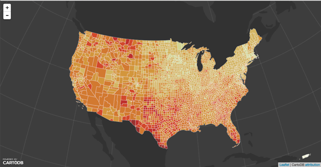  
**Figure 13**. The reprojected choropleth map with additional styled layers.

Note that we're not using specific columns from these layers for thematic representation (like the `uninsured` column in the `uninsured_adults_county` table), nor are we making interaction available (provided by including the `cartodb_id` column within the SQL request from the `uninsured_adults_county` table). Therefore these were not included within those SQL statements.


## Moving forward with CartoDB.js

In once sense, it appears we have done a lot of work (and wrestled with perhaps a fairly cryptic JS API codebase) to simply create the same map more easily achieved through the `createVIs()` method or even simply grabbing the URL from CartoDB's publish option. Why would we do all this, and what have we gained?

As you move forward to the lab, as well as consider using CartoDB for your final map project and other future maps, consider some of the following:

* Using CartoDB.js allows you to gain control over the presentation of the map within the web page. The CartoDB maps published by the viz are quick and easy, but the placement of such added elements as title, text, annotation, image, and legend items can be awkward and difficult to gain control over. Using the `createLayer()` method to make the map leaves the creative power of building HTML elements and placing/styling them with CSS in your hands.
* Maps created within the CartoDB editor are a bit of a one-shot deal in terms of the SQL queries that generate the mapped data, as well as the CartoCSS rules used to style and thematize the map. Bringing this functionality into the client-side script allows for queries and styling to be performed dynamically and interactively. See the CartoDB on [Basic Interactivity](http://academy.cartodb.com/courses/cartodbjs-ground-up/basic-interactivity/) for an example tutorial.  
* CartoDB is more than the Leaflet.js mapping library. While the CartoDB.js library offers some extended functionality on top of Leaflet, what makes CartoDB a good investment of our time for learning are the other powerful APIs and Data Services it offers within its mapping ecosystem. In particular the SQL API allows for data to both dynamically retrieved and updated to/from the database. Having a well-maintained database readily at our fingertips &ndash; and one fully equipped with PostGRES and PostGIS functionality at that! &ndash; is an amazing asset.
   
Finally, even if using CartoDB.js isn't suiting your needs (Leaflet is pretty neat by itself), you can still take advantage of CartoDB's terrific web database for storing and accessing your data. You can easily pull down your data taking advantage of the [SQL API](http://docs.cartodb.com/cartodb-platform/sql-api/).

For example, you can host your data on CartoDB and keep it updated there. Rather than having to update local GeoJSON or CSV files, you (or a client) can use the CartoDB data view editor to do this. Recall that CartoDB can also be set to pull in data from a Google Spreadsheet document or something similar as well.

Within your script, you can then use the JQuery `.getJSON()` method to request the data.

```javascript
$.getJSON('https://rgdonohue.cartodb.com/api/v2/sql?format=GeoJSON&q=SELECT * FROM uninsured_adults_county', function(data) {
        console.log(data); // you have access to the geojson data here!
        
        L.geoJson(data).addTo(map); // and you can simply use that GeoJSON 
                                                         // data to make a regular Leaflet map     
});
```  
**Code Bank 14**. Loading CartoDB-stored GeoJSON data with a JQuery AJAX call.

This provides a useful way to integrate your customized web map with a state-of-the-art PostGIS-enabled database.

Now go forth and rock some more web maps!