# Lesson 08: Integrating QGIS with CartoDB

## Overview

In this module we continue our move away from purely-desktop GIS operations to the exciting land of the web and web mapping. Within this module we introduce ourselves to a new key player in the web mapping world: [CartoDB](https://cartodb.com/). We can think broadly of CartoDB as contributing to the backend of our web mapping process, particularly how we store and access our data. However, as we'll see they also provide the ability to quickly make effective data-driven web maps through their web interface, JavaScript library, and web services. 

Within this module, we're going to introduce ourselves to CartoDB (literally, through creating an account with them), briefly get acquainted with some of the awesomeness that it provides, and figure out how to link it up with QGIS. Once we do all that, we'll be ready to explore a use case to see how we can integrate CartoDB within our mapping workflow. Specifically, we're going to begin by making a US counties choropleth map by joining some tabular data to some county polygons.

Let's get started!

## Data files

* *uninsured_adults_2015.csv*
* imported US counties Shapefile from US Census [Cartographic Boundary Shapefiles](https://www.census.gov/geo/maps-data/data/tiger-cart-boundary.html)

## TOC

* Creating a CartoDB account and profile
* Exploring the basics of CartoDB
* Loading data into CartoDB
    * Uploading data from your local machine to CartoDB
    * Loading data into CartoDB from a remote source
* The CartoDB Data and Map Views 
* Using the QGIS CartoDB plugin to connect with our CartoDB account
* Pulling data down from CartoDB into QGIS
* Performing a table join in QQGIS
* Pushing data back up to CartoDB
* Making a thematic map with CartoDB
* Publishing your CartoDB map to the web

## Creating a CartoDB account and profile

The first step is to visit the [CartoDB website](https://cartodb.com/) and create an account, if you don't already have one. You can create your account and get your free upgrade to the "Academy" Plan by following this link: [https://cartodb.com/signup?plan=academy](https://cartodb.com/signup?plan=academy). This plan will give you 250MB of data and as well as the table syncing functionality (much better than the normal free accounts).

You'll want to choose a good user name (and possibly one you share with other accounts such as your email and or your Mapbox account).

Take some time and set up your CartoDB profile. Eventually you'll be producing some maps with CartoDB, and they offer a nice public-facing interface with which you can share some of your maps and data. They even offer an option to indicate that you're "Available For Hire," so if you're able to make a few compelling maps hosted on CartoDB, perhaps a potential employer will find you!

## Exploring the basics of CartoDB

If you spend some time looking through [CartoDB's website](https://cartodb.com/) &ndash; and you should! &ndash; you'll see that you can use CartoDB to perform an amazing array of mapping tasks (some of which we've been completing using QGIS). In particular, you'll want to minimally glance through:

* [The Map Academy](http://academy.cartodb.com/) (CartoDB's online web mapping education material)
* [CartoDB's Documentation](http://docs.cartodb.com/) (including API documentation for using some of CartoDB's mapping platform and many useful tutorials for exploring specific CartoDB functionality).
* [CartoDB workshops](http://cartodb.github.io/training/) (a series of workshops given by CartoDB)

CartoDB's educational materials are quite excellent, and New Maps Plus encourages you to spend time reading through these and practicing some of their tutorials. The mapping and GIS world is immense, and the more ways you can approach problems and hear the material articulated, the better of you will be.

Once you've created an account and logged in, there are couple key things we want to point and and explore before we really dive in to the exchange of data and maps between QGIS and CartoDB. First, note that there are two "views" within CartoDB: a maps view and a datasets view. Pay attention to which one you're in, as you'll be switching between the two as you work with CartoDB. These are accessed in the upper-left of the webpage next to your name.

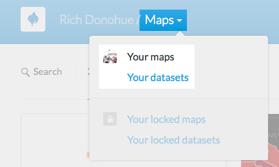

Figure 01: Accessing the maps vs datasets view

Take some time to familiarize yourself with the [CartoDB editor interface](http://docs.cartodb.com/cartodb-editor/).

Since you likely have neither maps nor datasets yet, let's first practice getting data into CartoDB.

## Loading data into CartoDB

CartoDB's interface is incredibly flexible and offers various ways to access [datasets already hosted by CartoDB](https://cartodb.com/data-library), as well as to load data onto their web servers.

### Uploading data from your local machine to CartoDB

A predictable way to get data into your CartoDB account is to simply upload a file or directory from your computer. To do this, first select **New Dataset** (you'll need to be in the **datasets** view of your dashboard and not the **maps** view).

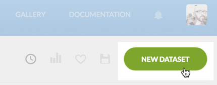

Figure 02: Selecting a new dataset in CartoDB

CartoDB supports an [impressive variety of file formats](http://docs.cartodb.com/cartodb-editor.html#supported-file-formats) including Shapefiles, GeoJSON, comma-separated and tab delimited files, and different spreadsheets. It also supports uploading compressed *.zip* and *.gz* files (i.e., your bundled Shapefiles in a *.zip* file).

Try uploading the *uninsured_adults_2015.csv* file included with this module (you may wish to examine the CSV file first within Open Office or a text editor). From CartoDB's **Connect dataset** page, choose **Data file** and **Browse**, locate the file in your local directory structure, and then click **Connect Dataset**. You can also drag and drop the file from your local window into the browser. 

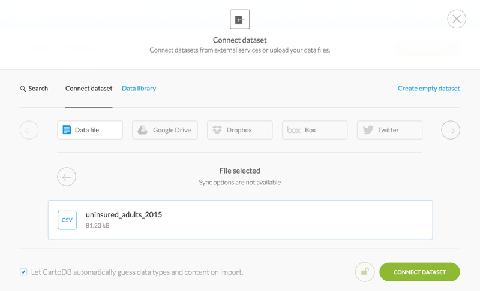
Figure 03: Selecting a new file

Note the option at bottom to "Let CartoDB automatically guess data types and content on import." Let's leave this check for the moment to see what happens.

Once uploaded to and processed by CartoDB, you will see your data in the Data View. Note that the values within *the_geom* attribute column for this file are all "null." This is simply tabular data with no spatial information. There are attributes such as state and county names, as well as FIPS ids, with which we can perform a tabular join with some county geometries. However, note that within the fips column (which is designated as a number type), CartoDB has stripped off the leading zero. CartoDB has automatically guessed this field to be a numeric type, and in doing so removed the leading zero. This can create a problem when attempting to do a Join, a problem we'll return to a bit later.

If you wish, try re-importing the CSV file, but leave the option to "Let CartoDB automatically guess data types and content on import" unchecked. This time, you'll notice that CartoDB has treated every field as a text string. This can be inconvenient, as you'd then need to manually change each field type (something that CartoDB actually makes quite easy). The advantage is, however, that the leading zero of a column such as our state+county FIPS codes is retained. Again, this small example underscores the importance of paying attention to data types when working with geospatial information.

It's a best practice, once you upload data to CartoDB, to immediately enter metadata about the data (click on **Edit metadata...** underneath the title "uninsured_adults_2015" and fill in the fields). This CSV data was pulled from the *2015CountyHealthRankingsNationalData.ods* file, (an [Open Office document format](http://www.openoffice.org/welcome/credits.html)) which is also included within this module's data directory and was downloaded from [County Health Rankings &amp; Roadmaps](http://www.countyhealthrankings.org/).

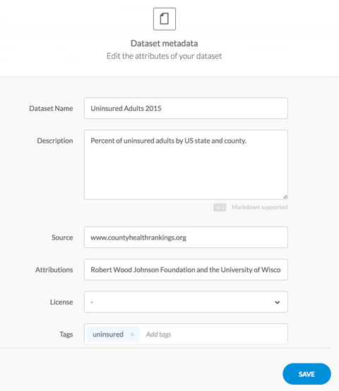

Figure 04: Entering metadata for the new dataset

Let's move on now to get some good county data to join with these uninsured data?

### Loading data into CartoDB from a remote source

A powerful and useful feature of CartoDB is the ability to load data from a remote source url simply by pasting in a URL. In the **Connect dataset** page of CartoDB, we wee a variety of options for loading external data into CartoDB. These include data stored within Google Drive or Dropbox. This can be a great solution for giving a client the ability to update a map with new data (e.g., they an simply update the values in a sharedGoogle Spreadsheet document and CartoDB will pull in the new information).

While we've seen how [Natural Earth](http://www.naturalearthdata.com/) is great for grabbing quick Shapefiles, another excellent resource for mapping with the United States is the [Cartographic Boundary Shapefiles](https://www.census.gov/geo/maps-data/data/tiger-cart-boundary.html). These files have been generalized and simplified at various scales for a variety of political sub-units.

Click to the [counties](https://www.census.gov/geo/maps-data/data/cbf/cbf_counties.html) and then copy the following URL: http://www2.census.gov/geo/tiger/GENZ2014/shp/cb_2014_us_county_20m.zip.

Paste this URL within the designated field and choose **Submit**.

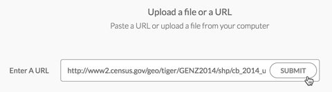

Figure 05: Connecting a remote database to your CartoDB account

CartoDB also allows you to Sync this dataset if you choose, meaning that if the original source data is updated, CartoDB will pull in any changes to the file. There's no need to do this now, but if you were using an external data file that is constantly updated, then this could be reflected in the Synced CartoDB dataset. 

Choose **Connect Dataset**. CartoDB fetches the file, unzips it, and loads it into your account.

When finished processing, CartoDB will open the data in the **Data View**.

## The CartoDB Data and Map Views 

First, note that these data encode the state FIP codes and the county FIP codes in separate columns, unlike the uninsured adults data we loaded into CartoDB above. This will present a challenge for us to complete our anticipated table join. However, the state and county fips codes within the county Shapefiles are loaded into CartoDB as string types, rather than number types. This usefully prevents the leading zeros from these codes from being removed.

Again, we should enter some metadata for these data before continuing.

Second, note that the **the_geom** field contains Polygon information.

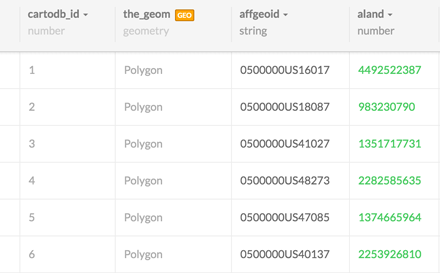

Figure 06: **the_geom** field values encode Polygon information

Double-click on one of these values within the **the_geom** field. What you're presented with is the GeoJSON encoding of that polygon, in this case encoded as a "MultiPolygon" with latitude and longitude coordinate pairs. CartoDB converts the uploaded geometries, whether Shapefile or georeferenced CSV, into GeoJSON format.

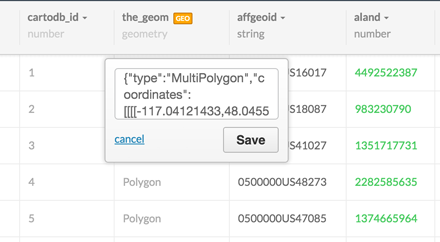

Figure 07: **the_geom** field values Polygon information are encoded as GeoJSON

Switch to the **Map view** to see the county polygons drawn to the map. CartoDB will, by default, display the county boundaries with a solid orange color using the Web Mercator projection. 

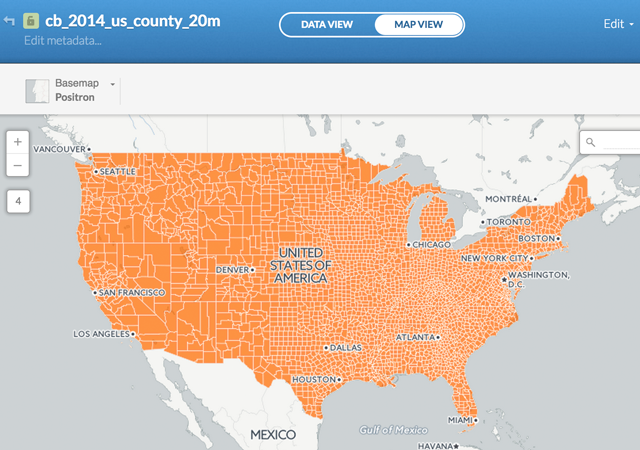
Figure 08: US Counties drawn with default settings

Click on the **CartoCSS editor** icon to the right to open the editor panel. Within this editor we see the CartoCSS style rules that dictate what is displayed on the map and how. We're not going to spend a lot of time worrying about how to write these style rules form scratch right now. We recommend you read through [CarotDB's CartoCSS documentation](http://docs.cartodb.com/cartodb-platform/cartocss/) to gain more of an understanding.

However, let's quickly walk through what's happening with this CartoCSS code.

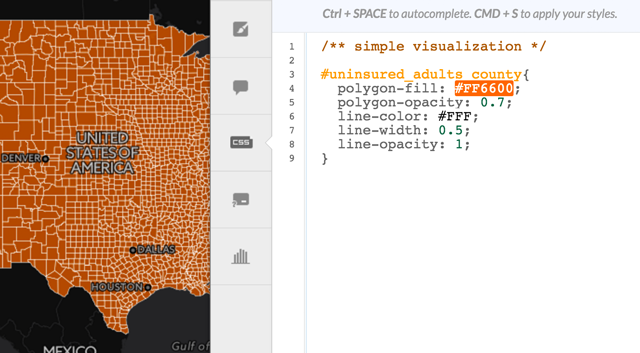

Figure 09: diting the CartoCSS within the CartoCSS editor

A style "rule" (Figure 09, line 3) selects all the data (i.e., our polygons) from our dataset *uninsured_adults_county* using the hashtag and applies the style rule properties (contained within the curly brackets) to those features. These property rules include the fill and opacity of the polygons (Figure 09, lines 4 and 5), as well as the color, width, and opacity of the lines (Figure 09, lines 6 - 8). 

Knowing all the property names (e.g., the *polygon-fill* and *line-opacity*) is the tricky part of learning a styling language such as CartoCSS. The values are easier to play with, however. In this case, the color values are encoded as hexadacimal values, opacity values are decimal numbers between 0 and 1, and the line width is whatever number you'd like. If you're not familiar, the value #6B0Fb2 is a [hexadecimal color code](https://developer.mozilla.org/en-US/docs/Web/Guide/CSS/Getting_started/Color).

We're not going to master these CartoCSS rules right now, but feel free to play around with them within this editor. For instance, hover over the #FF6600 and choose a different color. You'll see this change reflected on the web map. Adjusting the values for the opacity and line widths will require that you click on the **Apply style** button bottom right (or Ctrl+S to save). Play with these values to see the changes reflected in the map. For instance, we can change the polygon-fill to a purple value.

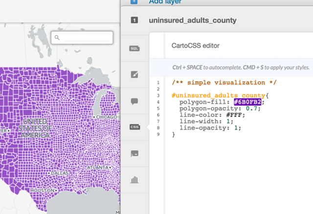

Figure 10: Editing the CartoCSS within the CartoCSS editor

That's enough basics on data loading and the interface tour for now. We highly encourage you to take some time to further explore CartoDB's tutorials and documentation on your own. 

## Using the QGIS CartoDB plugin to connect with our CartoDB account

To link CartoDB with QGIS, first install the [QGISCartoDB Plugin](https://plugins.qgis.org/plugins/QgisCartoDB/) (i.e., go to **Plugins -> Manage and Install Plugins...** and search for "QGISCartoDB" like we've done with other plugins).

After it's installed, be sure to enable your Web Toolbar within QGIS (**View -> Toolbars -> Web**).

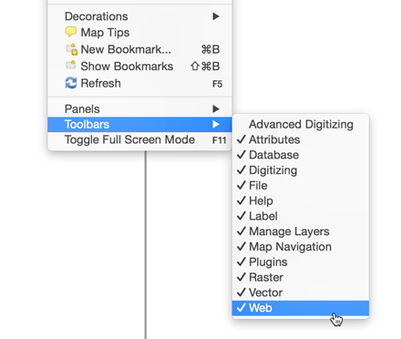

Figure 11: Enabling the Web Toolbar

With this toolbar enabled, we should now see several icons associated with the QGISCartoDB plugin:

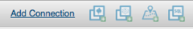

Figure 12: QGISCartoDB icons in the QGIS Web Toolbar

The icon buttons will be inactive until we connect to our CartoDB account. The options we are given allow us to download and upload layers from the account, as well as load a map directly from QGIS to CartoDB. 

Click on **Add Connection** to open the Connection Manager dialog box. Then choose **New** to create a new connection. This will open the Add CartoDB Connection dialog box.

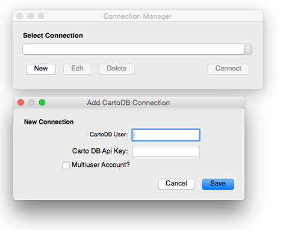

Figure 13: Adding a new connection through the Add CartoDB Connection Manager

You'll enter your CartoDB User name in the first field. To access your CartoDB API key, you'll need to be logged into your CartoDB account and go to "Your API keys" (https://*your_username*.cartodb.com/your_apps). You can also click on your avatar within the CartoDB dashboard and choose "Your API keys."

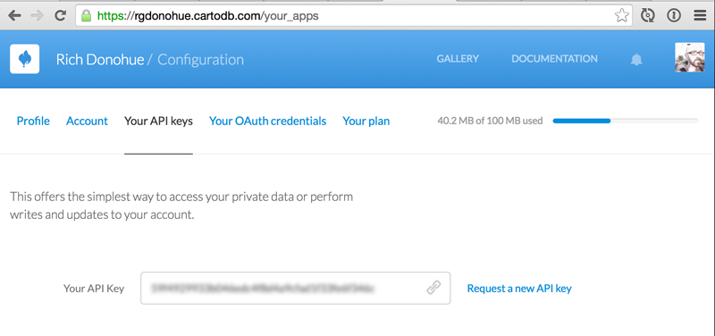
Figure 14: Obtaining the CartoDB API key for use with the QGIS plugin

Copy your API key from the CartoDB website and paste it into the Add CartoDB Connection dialog box, and choose **Save**. Your username will now appear as a Connection in the Connection Manager. Choose **Connect** to connect QGIS with your CartoDB account.

### Pulling data down from CartoDB into QGIS

Once the connection is made, we can start doing all sorts of fun things with QGIS and CartoDB. For a use case, let's reform a tabular join between the US counties layer and our uninsured adults data to make yet another classic choropleth map. While we could do this within CartoDB, the stripping of the leading zero in the data file makes this problematic at the moment. Our goal then is to us QGIS to perform the join and populate the county shapefile data with the uninsured data. When complete, we'll push this data back up to CartoDB and use it to make a web map.

To begin, let's pull down those data of the US counties we just uploaded to our CartoDB account (we're not going to use the copy of the uninsured adults data we uploaded to CartoDB, so feel free to delete it from your account). Click on the **Add CartoDB layer** button/icon.

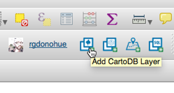

Figure 15: Adding a CartoDB layer

This will open a **Add CartoDB Layer** window which will display all your available datasets, as well as inform you of your available data usage. Choose the *cb_2014_us_county_20m* layer we previously loaded into CartoDB from the Cartography Boundary Files.

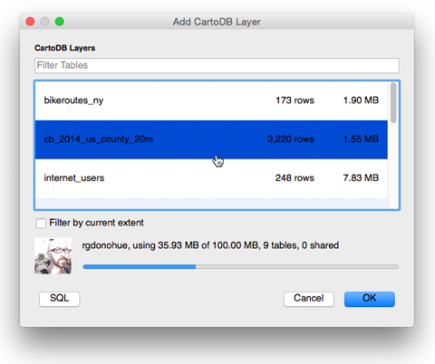

Figure 16: Adding a CartoDB layer

After downloading, we'll see a very familiar layout of the vector data within QGIS **Map Pane** and the layer listed within the **Layers Panel** at left. So far this is operating like any other file we've loaded into QGIS from our local source. For instance, we can go into the layer properties to see the Coordinate Reference System or symbolize the data in some way.

However, there is one important distinction between this data layer and others we may load into QGIS from our local machine. Open the layer's **Properties** and look at the **General** tab. Note that under **Layer source** it provides a rather curious path (this path will be different on a Window's OS): */var/folders/8n/5pypfm3n3bsfg66n7jt8fn1c0000gn/T/tmpN9gDLu*. What is this *tmpN9gDLu* file to which the source is pointed? 

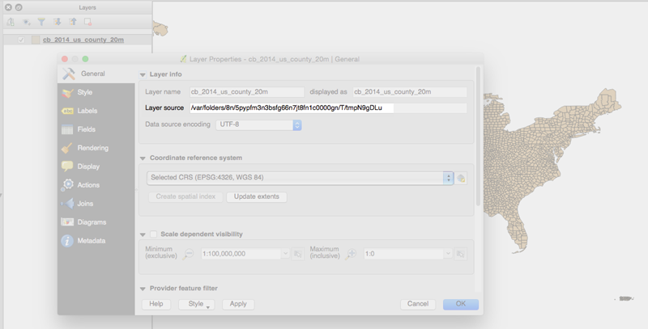

Figure 17: Identifying the temporary layer source

It doesn't look like any other data format we've worked with so far (e.g., Shapefile or GeoJSON files). Here QGIS and the QGIS Plugin are storing a temporary version of these data as a binary file (i.e., we aren't meant to directly read this file within our file/directory structure). This means that if we wish to make edits to the geometry or to attribute table, or do any geoprocessing, we first need to save a local copy of these data in another format (likely a Shapefile format).

## Performing a table join in QQGIS

Go ahead and right-click on the layer, choose **Save As...** and save it a new Shapefile within your project's data directory. Give this new layer a different name than that which we imported from CartoDB, *cb_2014_us_county_20m*, such as *us_counties*.

Now we wish to edit the attribute table within this US counties Shapefile to concatenate the state FIP code ("statefp") with the county FIP code ("countyfp") and store these within a new column. Do this, open the Attribute Table and then click on the **Field Calculator**. This will automatically open the Editing mode of your Shapefile's attribute table as well.

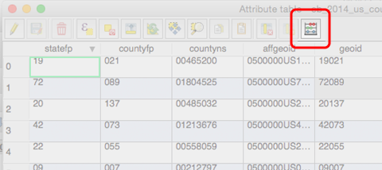

Figure 18: Opening the field calculator

Within the field calculator we want to keep **Create a new field** checked and provide a name for the new output field ("fips" works fine for this now). Change the **Output field type** to "Text (string)". Even though the FIP ids could be encoded as number types, encoding them as string types ensures that we don't lose the leading 0s on some of the IDs, especially when we import the Shapefile back into CartoDB.

In the Expression dialog box we want to enter *"statefp" + "countyfp"*. Note that because these are string types, it will concatenate them together, and not calculate them as if they were numbers. You can also access the available fields under the dropdown menu of *Fields and Values*. 

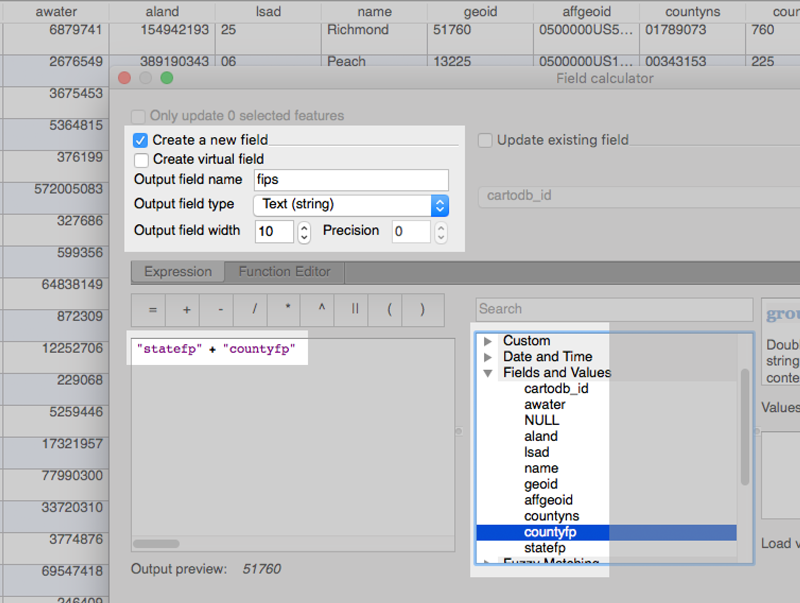

Figure 19: Using the field calculator to concatenate field values

Read more about using the [Field Calculator](https://docs.qgis.org/2.2/en/docs/user_manual/working_with_vector/field_calculator.html) in QGIS.

Once you have entered these values, click OK. QGIS will create a new field named "fips", in which you see the newly created string values. You'll want to now toggle off the editing mode. QGIS will prompt you to Save the changes to the layer, which you do want to do by clicking **Save**. Close your attribute table. 

You might have noticed, we already had a *geoid* field in the counties layer that could be used for an attribute join. We wanted to illustrate using the Field Calculator on text strings. Building attributes like this will be helpful when you need to produce a minimized attribute table for interactivity in CartoDB. Interactive pop-up boxes use your attributes for content and can often cleaned up and aggregated. Imagine if you could minimize a couple fields in OSM data to one field:

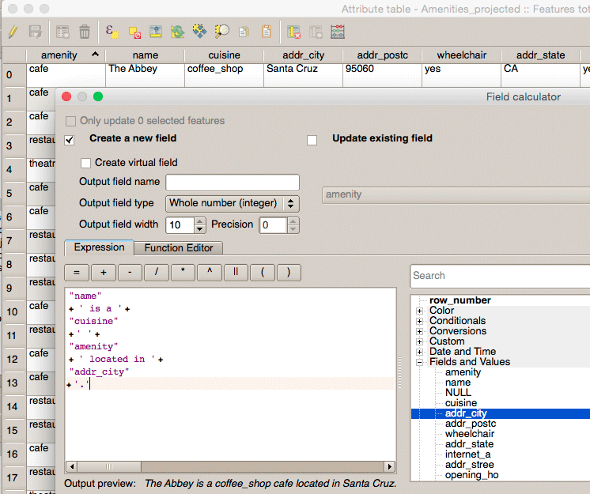

Figure 19.1: Using the field calculator to concatenate field values into new strings for pop-up boxes. Note the Output preview is a more friendly presentation of the attributes.

Next, let's import our uninsured adult data into QGIS. The best way to do this, and not have QGIS also strip the leading zero from our FIPS data attribute values like CartoDB did, is to drag the file directly from your browser window into the Layers Panel of QGIS. You can also use the *.csvt* file with one line indicating the data types, "Real" and "String" for the appropriate type. If you then inspect this attribute table within QGIS, you'll see the FIPS id codes have been imported while retaining the leading zero. However, if you added this file as a Text Delimited File (with "no geometry" checked), you'd like run into some problems.

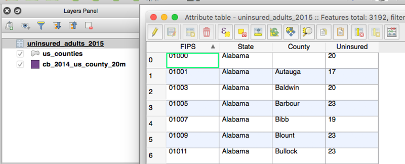

Figure 20: Veryifying that the leading zeros of the FIPS field values are retained

Now we're ready to perform our trusted table join. To quickly walk you through the steps again:

1. First access the Layer Properties of the newly created *us_counties* layer (the one with the concatenated state and county fips codes) and open the **Joins** panel. 
2. Click the green arrow at the bottom left to add a new join. Within the Add vector join dialog box, use your *uninsured_adults_2015* as the **Join layer**, choose *FIPS* from that data table as the **Join field**, and use the *fips* field we created as the **Target field**. Next click **Choose which fields are join** and select only the *Uninsured* field, as we don't need to duplicate the other field values within our county Shapefile. Also we don't need a **Custom field name prefix** in this case, so check that option and leave the field blank. When complete, click **OK** on the dialog box and **Apply** the table join.

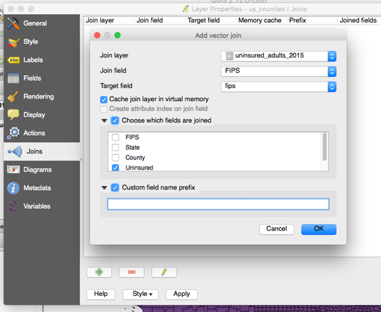

Figure 21: Settings for joining the uninsured adults data to the county polygons

We can verify that the table join was successful by again opening the *us_counties* layer's attribute table. Sorting the features by the *fips* ID will verify that the insurance was applied to all the features, including those beginning with a zero (e.g., "01001"). Close the attribute table.

Now that we've joined the data to our geometries, we could continue to make a choropleth in QGIS. But let's instead push this new Shapefile back up to CartoDB and use it to make a web map.

Before we push our data back up to CartoDB, we need to save a new Shapefile layer to ensure that the table join is permanently encoded within the layer. Choose **Save As ...** and name the new Shapefile *uninsured_adults_county* (or something else fitting). CartoDB will import the data using this name and later use it to create maps. Create the new Shapefile with the geographic SRS of WGS84 and make sure it's added to your QGIS project.

## Pushing data back up to CartoDB

Note that because our CartoDB account size is limited, we can also reduce the size of the datasets by deleting field columns we're not using. We'll skip this step for now, but if you wished you could use the **Table Manager** to delete such columns as *aland*, **awater**, etc. The process is covered in detail in the lesson video. This is less important with a fairly small dataset like the one we're now working with. However, sometimes you'll bring in a dataset with thousands of features and many data fields you don't need. It's worth trimming the file size down in these cases.

Click the **Upload layers to CartoDB button**, choose the *uninsured_adults_county* layer from the **Project Layers**, and click Upload. Note that leaving **Add CartoDB layers to project** will add this layer to the QGIS project (which we don't need right now, so go ahead and uncheck this option).

The **Upload layers to CartoDb** dialog box will indicate that the upload was successful.

Switch back to your CartoDB account within your web browser. Make sure you're in the **Datasets** view of your dashboard. It may take a few moments for CartoDB to connect the new dataset within their servers. When complete, you'll see your *uninsured_adults_county* within your datasets view, along with the *cb_2014_us_county_20m* layer we imported earlier.

## Making a thematic map with CartoDB

Now that we have our uninsured adults data tied to our county geometries and back in CartoDB, let's use that dataset to make a quick web map?

Click on the newly uploaded *uninsured_adults_county* layer in CartoDB. It will first open in the **Data View**. Here we're looking at our familiar attribute table. Note that CartoDB conveniently displays the data type (e.g., *string*, *number*, etc) for these fields, as well as offers a fast way to convert them (no need to go through some complicated field calculator operation here!). We see that our *uninsured* field column is present, though it is a *string* datatype. In order to create a map using these values as a quantitative measure, they need to be a number type. Click on the down arrow next to the field title and choose **Change data type ...**, choose *number*, and then confirm the type change. 

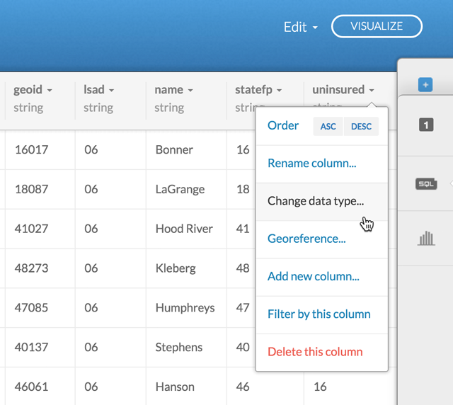

Figure 22: Changing the data type of a field in CartoDB

CartoDB will process the request and alert you to when the field values have been converted to a number type.

Next click on the **Map layer wizard** icon (above the **CartoCSS editor** icon). Choose Choropleth from the available options. By default, CartoDB will draw a choropleth map using the first numeric column in the dataset. In this case it's land area, which makes little sense. In the **Column** dropdown menu, choose *uninsured*. Since these numbers are a percentage (a rate), they have already been normalized. Hence we don't need to worry about normalizing this column (something that CartoDB is currently not great at). 

We can then adjust the number of classes (CartoDB curiously calls them "**Buckets**"), as well as the method of **Quantification**. Try changing the quantification method between equal area and quantiles to inspect the differences in the rendered map. CartoDB's interface quickly allow us to produce a choropleth map of these uninsured adult data (abeit ).

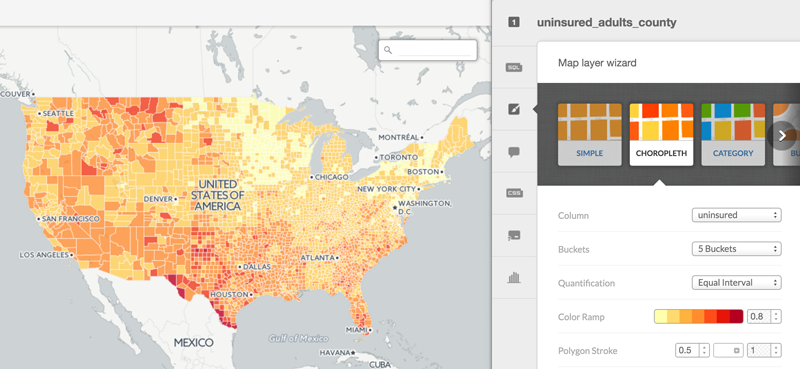

Figure 23: Creating a choropleth map using CartoDB Map layer wizard

Before we publish this map, click back to the **CartoCSS editor**. We can see that the **Map layer wizard** has added additional CartoCSS rules. Again, we're not going to dive deep into mastering CartoCSS right now. Making adjustments in the **Map layer wizard** and toggling back to inspect the changes in the **CartoCSS editor** is actually a good way to facilitate your understanding of how to the CartoCSS rules rules work.

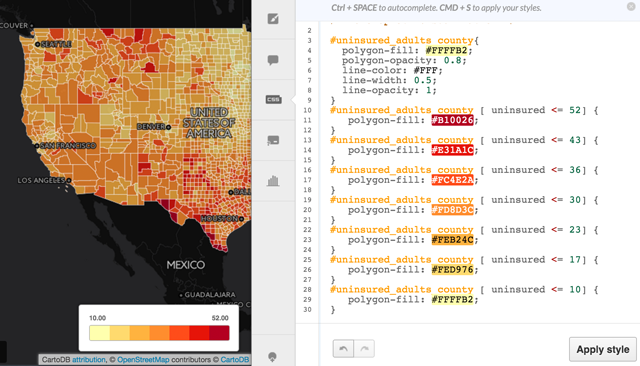

Figure 24: Creating a choropleth map using CartoDB Map layer wizard

Like we discussed above, the first style rule selects all the data from our dataset *uninsured_adults_county* and applies some style rules to all of them. Below this, we see there are additional style rules that select our *uninsured_adults_county* dataset layer, but also include a conditional expression with square brackets (e.g., "uninsured <= 52"). CartoDB is using a series of these conditional statements to set the classification breaks on our map, and then applying a new style rule to each polygon. If we wanted to manually adjust the map using the CartoCSS rules, we could edit the "breakpoints" used to create the classes, as well as the values for the colors being applied.

## Publishing your CartoDB map to the web

Next, click **Visualize** in the upper right. This will prompt you to publish your map. Click **OK, Create Map**. 

The map is now created, though we're still using the same visual interface (e.g., **Data View** or **Map View**) to interact with the map and the data. But here we can add additional elements to the map (accessed upper left), such as a map **title**, **annotations**, or a **text item** (within which you could include metadata or supplementary text). We can also change the basemap (accessed lower left), as well as select different options for the map (accessed lower left) such as a **Search box**, **Scroll wheel zoom**, and whether we wish the map to be displayed **Fullscreen**.

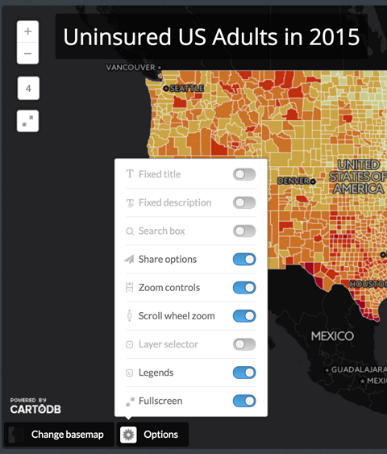

Figure 25: Adding a title, and changing the basemap and map options

After you've played around with some of these adjustments, click **Publish** in the upper right corner of the browser window (don't worry, you can easily make further adjustments and re-publish at any time). You'll be presented with three publishing options: 1) to copy a link to a live version of the map, 2.) to embed the map within an iframe, which then be inserted into a webpage or blog, or 3.) to access the map using a JavaScript API (which we won't be addressing in this introductory course). Copy the link to the map, open a new browser tab or window, and paste in the URL link. You'll see a working version of your map.

This published map is different than the dataset you've been working with in the map view. To continue to work on the map, return to the map view, make updates, and again click **Publish** to update your map.

Note that by default CartoDB renames this map as a copy of the original data source. Feel free to rename the published two whatever you'd like. Also notice that the published map will retain the original zoom and pan level at which it's set within the **Map view** when you publish it. To change this, simply adjust the display in some way and click **Publish** again.

You can now share this map with the world!

##Resources and references

* [The Map Academy](http://academy.cartodb.com/) (CartoDB's online web mapping education material)
* [CartoDB's Documentation](http://docs.cartodb.com/) (including API documentation for using some of CartoDB's mapping platform and many useful tutorials for exploring specific CartoDB functionality).
* [CartoDB workshops](http://cartodb.github.io/training/) (a series of workshops given by CartoDB)
* [Free Your Maps from Web Mercator!](http://blog.cartodb.com/free-your-maps-web-mercator/)