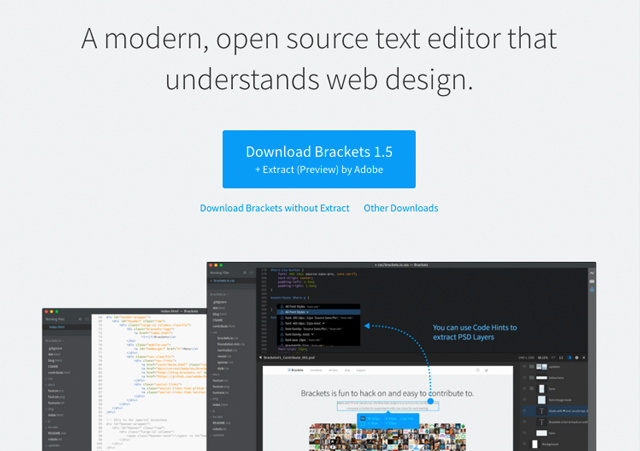
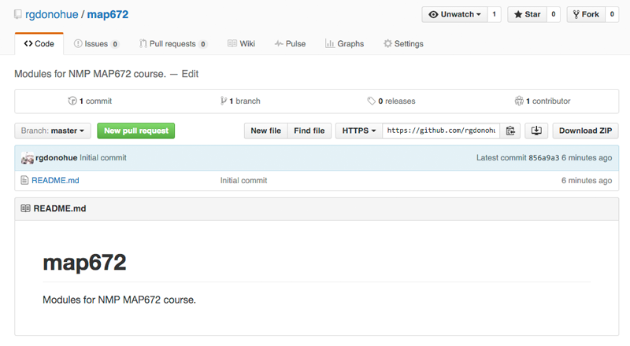
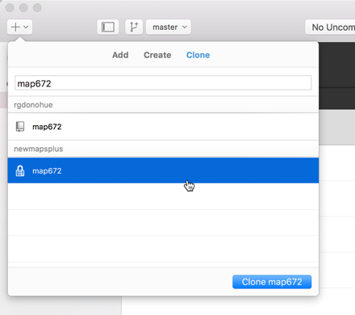
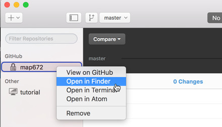
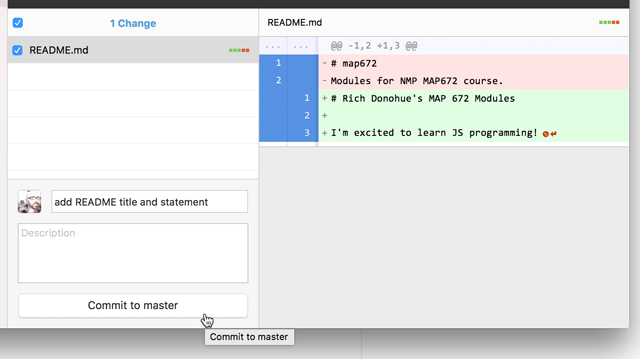
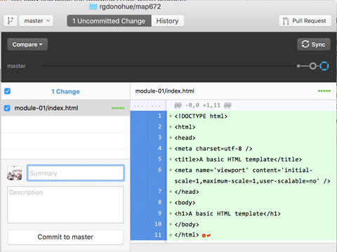
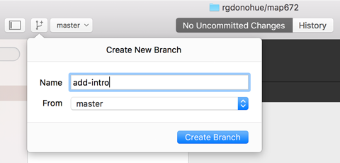
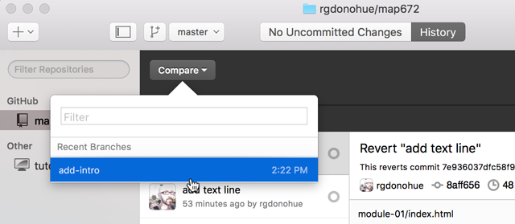

# Lesson 01: Setting up a Modern Mapping Environment and Workflow

## TOC

- [Overview](#overview)
- [Installing and using the Brackets text-editor](#installing-and-using-the-brackets-text-editor)
- [Using Git and GitHub](#using-git-and-github)
- [Introduction: What is Git?](#introduction-what-is-git)
    - [A brief background to Git and history of version control](#a-brief-background-to-git-and-history-of-version-control)
- [Setting up an (educational) account with GitHub](#setting-up-an-educational-account-with-github)
- [Download GitHub for Mac/Windows and basic configuration](#download-github-for-macwindows-and-basic-configuration)
- [Creating a new repository on GitHub](#creating-a-new-repository-on-github)
- [Cloning a remote repository to your local drive](#cloning-a-remote-repository-to-your-local-drive)
- [Making changes to your repository](#making-changes-to-your-repository)
- [How does Git work?](#how-does-git-work)
- [Commit history and reverting changes](#commit-history-and-reverting-changes)
- [Branching and Merging](#branching-and-merging)
- [Your Git/GitHub workflow moving forward through MAP672](#your-gitgithub-workflow-moving-forward-through-map672)

## Overview

As almost all the software involved in a modern web mapping workflow involves text-based files (data formats and coded scripts), the essential tools for a web mapper make handling these text files as easy as possible. In this lesson we will introduce two specific programs we'll be using throughout this course and beyond, and the process for using them.

**1. Brackets** is a free and open-source text editor for working with code and design. It has a number of features that you’ll come to love such as code syntax highlighting (to make code more legible), auto-complete (for when you don’t want to type or remember that long variable name), and live preview (so you can visually see how your code would be rendered in the browser).

**2. Git and GitHub**. Git itself is what's known as a "distributed version control system." It records changes to the various files in your project (a "repository" or "repo" for short, in Git speak) as you progress through your work. This allows you to track different versions and, if (or when!) you mess up, go back to a previous version. Git also facilitates better collaboration on web projects.

This lesson will familiarize you with using these tools and establish a workflow we'll be using throughout the course as we learning JavaScript programming for web mapping.

## Installing and using the Brackets text-editor

Throughout the web mapping process, and this course, we'll be spending a lot of time writing code. Code is written in plain-text, and we can do this with any text editor. However, having a powerful text-editor such as Brackets makes the process much easier and more enjoyable. Let's first get Brackets installed on our machines.

Download a copy of Brackets for either Mac or Windows from [http://brackets.io/](http://brackets.io/). We won't be making use of the "Extract for Brackets" functionality, so feel free to  download the version *without*  Extract.



Figure 01. Download screen for Brackets

Of course, there are other alternative text-editors to Brackets. Popular ones among web mappers and developers include [Sublime Text](http://www.sublimetext.com/) and [Atom](https://atom.io/). You're welcome to use these editors, although as of this writing Brackets has a distinct advantage for us: it comes with its own local web server, which we'll be exploring in greater detail within in Module 02. 

If you have any trouble getting it installed and launched, consult the [Troubleshooting](https://github.com/adobe/brackets/wiki/Troubleshooting).

Once it's installed, feel free to open it up and play around. When you first open Brackets, a "Getting Started" project will open. You should follow these instructions to familiarize yourself with the application's interface. Also, read [How to Use Brackets](https://github.com/adobe/brackets/wiki/How-to-Use-Brackets).

Before we start using Brackets for our New Maps Plus mapping, let's first get our Git process up and running.

## Using Git and GitHub

Within MAP672 we're going to use Git to keep track of changes to our files and code, as well as to share and submit our work on the web. We're going to cover Git in both a conceptual and practical sense. We'll conceptually run through it first. Then, we'll actually implement it and practice using it so we understand the process.

For more practice using Git, consider running through Codeacademy's [Learn Git](https://www.codecademy.com/learn/learn-git) (approximately 2 hours).

### Introduction: What is Git?

Git is a **Distributed Version Control System (DVCS)**. Okay, but what's a version control system (VCS)? A VCS records all changes made to a computer file or set of files. This allows you to review any changes made to the files under version control, and allows previous versions of files or projects can be recalled at a later time. Basically, if you mess something up, accidentally delete or copy over a file, you can retrieve an earlier copy of that file.

We'll note now that there are two ways of installing and using Git on your computer system: 1.) with a desktop software client, and 2.) via command line (using the Command Prompt on Windows or the Terminal on a Mac). 

**Recommended:** We're going to primarily be instructing this course with the first method using the [GitHub Desktop Client](https://desktop.GitHub.com/) because of the simplicity and ease of use. Additionally, this software client installs the Git software on your system along with the client interface (so no need to do that step separately).

To use git outside of the GitHub Desktop client, you need to have experience with using shell or command line prompts. To use Git via command line, you need to first install Git on your machine ([Git for Windows Setup](https://git-scm.com/download/win) or [Installing on Mac](https://git-scm.com/book/en/v2/Getting-Started-Installing-Git#Installing-on-Mac)), preferably so it's globally accessible (i.e., you can run a Git command from whatever directory you're in). Then, rather than using a software interface to use Git, you'll be issuing textual commands. 

If you wish to pursue this more advanced command line approach, that's okay. Just understand that we're not explicitly teaching this method within the course, and that the course instructor may not have the time to troubleshoot potential problems with you. The process for connecting with GitHub is a little more complicated as well, so if you want to make life easier for the time being, just stick with the Desktop Client.

#### A brief background to Git and history of version control

VCSs have been used for a long time. A very simple form of version control is simply making backups of your files or project directories and storing on a local computer or network system. Of course, this requires one keep careful track of files and file names, often manually. Developers use centralized Version Control Systems (CVCSs) to collaborate with others on projects, which used a single server and database to store files and keep track of all versioned files and changes. Examples of these CVCSs include Subversion and Perforce. While CSVSs were better than developers keeping their own versions of files on their local machines, this centralized approach also provides a single point of failure. If the server crashed (or even worse, became corrupted), the project was still at risk of being lost.

To address this risk, in recent years developers have migrated their workflow to Distributed Version Control Systems (DVCS) such as Git, Mercurial, Bazaar, and Darcs. The primary benefit of a DVCS is that rather than keeping a single backup of a project, every client who "clones" the project fully mirrors the entire repository. This approach "distributes" a full backup of project files among all local computers working on the project.

Git takes a particular approach to version control. Rather than making a fullback of the project with each version and storing a list of file-based changes like other VCSs, Git saves the state of the project as a "snapshot" of what the files look like at the time of commit (more on "committing" below). If a file has changed since the previous commit, then that file is saved and the change is recorded in the reference to it within the snapshot. If a file hasn't changed, then there is no need to re-copy the file, and Git simply retains the previously stored reference. This makes Git very efficient compared with other VCSs. Another strong advantage of Git is that repositories are always downloaded, stored, and manipulated locally, which means Git runs very fast (i.e., no need for server requests), and you can work even without an Internet connection.

Today, another huge advantage of using Git is its close integration with [https://GitHub.com/](GitHub). **GitHub** is a website that provides a platform to share your Git repositories. This is very powerful as it allows other people to collaborate with you on the same repository, and you can even share your projects with the broader public via open webpages. During the course, you will also use this mechanism to submit and share your assignments with your instructors.

### Setting up an (educational) account with GitHub

To get started with GitHub, you first need to create an account.  Navigate to [https://GitHub.com/](https://GitHub.com/) and sign up with a username, password and email address. **Make sure you use your @uky.edu address as you need it for the next step.** It also may be useful to use the same username you use for CartoDB, Mapbox, and other online accounts, for consistency. 

Once your account is created, take a moment to update your profile (under **Your profile**) by clicking on the avatar upper-right corner. Uploading an image of yourself is preferable, as well as giving your name, location, and a URL to a website if you have one.

GitHub is free to use but it also has paid plans. These paid plans offer the possibility of making repositories private instead of public. This is very helpful while we’re still learning as we may not want our stumbles and ugly code to be visible to the entire world. Later on, private repos are when working for a client who wants to keep data and development private for the time being.

Fortunately, GitHub provides this service of private repositories free-of-charge to students! Once you’re signed-up, go to [GitHub Education](https://education.GitHub.com/) and click on the blue "Get the Pack" button. It includes access to GitHub private repositories as well as a bunch of other cool stuff. 


Figure 02. GitHub Education

Sign in with your GitHub account (if you haven’t done so already) and follow the instructions. GitHub will ask you to submit a request using your @uky.edu account. Once you’ve submitted it might take a while to get approved, but we can get started using the public repositories in the meanwhile. You can switch the repository to be private once your upgrade is approved.

### Download GitHub for Mac/Windows and basic configuration

Now that we have our remote (i.e., it's on the web) GitHub account set up on the web, let's get Git and the GitHub Client running on our local machine. Depending on your operating system, download the GitHub Git Client from [https://desktop.github.com/](GitHub Desktop).

Once downloaded and opened, GitHub Desktop will ask you to walk through some configuration steps. Enter your username and password you created earlier, and then supply your name and email. Please make sure your real name is used here, so that your colleagues &amp; instructors can actually identify you. Once the configuration is successful, you should see an empty GitHub window. We’re finally ready to roll.

For further documentation on this process, see [Getting Started with GitHub Desktop](https://help.github.com/desktop/guides/getting-started/).

### Creating a new repository on GitHub

Let's first create a new repository on the remote GitHub server through the web interface. Navigate to your GitHub account (e.g., *https://github.com/username*). Click on the small plus symbol upper-right and choose **New repository**.


Figure 03. Creating a new repository in GitHub

On the next screen, create a new repository for the course by typing in *map672* under the repository name. Provide a brief description of the repository (e.g., "Modules for NMP MAP672 course."). Leave the repository **Public** for now, unless you've been upgraded to the educational account, in which case you can mark it as **Private**. Finally, check **Initialize this repository with a README** before clicking the green **Create repository**.


Figure 04. Creating a new repository in GitHub

Congratulations! You've created a repository for the course. Right now, the only file within your repository is a filed named *README.md*. The contents of this file are also displayed within the GitHub web interface by default.



Figure 05. Creating a new repository in GitHub

The extension *.md* stands for markdown, which is a [text-to-HTML](https://daringfireball.net/projects/markdown/) conversion tool for writing content on the web. GitHub uses markdown to store much of the textual content, and at NMP we've written the lessons and laboratory assignments for you in markdown. A *README.md*. file commonly accompanies every new repo to tell users about it.

### Cloning a remote repository to your local drive

First, we'll clone the empty remote *map672* using  GitHub Desktop. Switch back to your GitHub Desktop application. Click the plus sign in the upper left corner of the window and choose to **Clone** a repository. Navigate to your repo or search for it within the **Filter** (if this is your first GitHub repository, then there will only be the one) and click **Clone map672**. You will only clone your repo this one time (unless you loose your local copy and need to clone a fresh one down to your computer).



Figure 06. Creating a new repository in GitHub

Next, clone the *map672* repository down to your local machine. You be need to select a location on your local machine to save your repository. It doesn't matter where it is, as long as you remember where. As always when working on a computer, **stay organized**. For example, I keep  my repositories within a directory named *github.rgdonohue* within my *Documents* directory. Select a location and choose **Clone**.


Figure 07. Choosing a location to clone new repository in GitHub

After you click **Clone**, GitHub Desktop will essentially copy the repository from the remote web server to your local machine. Once it's complete, you can verify the process by looking at the repository within your local file/directory structure (hint: you can right-click on the repo name within GitHub Desktop and choose **Open in Finder**).



Figure 08. Opening the local repository directory through Finder

When you open this repository in your file/directory structure, you'll see that the repository is contained within a directory named *map672*. Within this repo, you'll see one file and a hidden directory (you may need to have the settings enabled so you can view hidden files on your OS): the file is the *README.md* file and the (hidden) directory is named named *.git*. The *.git* directory is used internally by Git to track your files and changes, and you will not directory use the files within this directory. Deleting it will delete the record of your repository. A Git repository also uses relative paths with respect to this *.git* directory, so you could conceivably move the entire *map672* directory to another location on your drive or another computer (or USB drive) and continue working with the files.

Switch back to GitHub Desktop. Note that at the top of the window are two tabs: One says "No Uncommitted Changes". This indicates that you currently have no committed changes recorded by Git, and the panel below indicates "0 changes."


Figure 09. Opening the local repository directory through Finder

Next click on the **History** tab. This will show you all the committed changes to your repository. Here we see there is one commit in the history: the initial commit that GitHub performed in the web-based environment.


Figure 10. Opening the local repository directory through Finder

This is likely the only change and commit that will occur within the web environment. All further changes and commits will first happen within your local development environment, and then pushed up to the remote copy of the repository. Let's practice doing that now.

### Making changes to your repository

Launch your Bracket's text editor, if it isn't already open. Choose **File -> Open Folder**, and navigate to your local copy of the *map672* repository. **IMPORTANT:** throughout this course, it is best to **open the entire directory** of the repository or individual directories within it (e.g., a weekly*module-02* directory), rather that directly opening one file. Doing so conveniently keeps the file/directory accessible to you within Brackets's sidebar. In this case, we can see our *README.md* file.

Clicking once on the *README.md* file displays the contents of the file within Brackets.


Figure 11. Displaying the contents of the file in Brackets

Double-click on this file within the left-side bar. Note that Brackets now displays the file under a sub-heading in the self-side bar called **Working Files**. The file is now "open" in Brackets for editing. **IMPORTANT:** throughout this course, always make sure the file you're editing is open under the **Working Files**.

Let's make some basic changes to this markdown document. GitHub automatically wrote the description we provided when we created the repository within this markdown file. Edit the file in some way, **save your changes**.  For instance, I'm going to modify the contents of the markdown file to be:

```html
# Rich Donohue's MAP 672 Modules

I'm excited to learn JS programming!
```


Figure 12. Making a minor change to the markdown text

**IMPORTANT:** Always remember to save your changes to your file in Brackets before looking for the result in the browser or GitHub Desktop. Switch back to the GitHub Desktop.

We can see at the top of the client that there is "**1 Uncommitted Change.**" Click on this tab. In the right-hand panel, you can see the previous text highlighted in red, and the new text highlighted in green. In Git-speak, this is called a "diff" — it shows the difference between two version of the same file. Lines with a small "-" have been deleted and those with a small "+" have been added. Key additions/removals are indicated by green and red colors.


Figure 13. Seeing one uncommitted change in GitHub Desktop

Next, let's commit this change to our repository. A commit bundles anything that has changed and creates a snapshot of the current state of the repository. Each commit then becomes an individual snapshot that you can access later.

Every commit to a repository requires a commit message. These messages should be descriptive of the changes you made to the files since the last commit. The convention is to use present tense verbs (i.e., "update map title" or "add GeoJSON file to project"). 

Within the GitHub Client, enter a commit message. A longer description of the commit can also be added. When complete, hit **Commit to master**. Note that this commit is being added to the master branch (we'll talk more about branches and branching below).



Figure 14. Entering a commit message and committing the staged changes to the master branch

After clicking **Commit to master**, GitHub Desktop returns to show there are **"No Uncommitted Changes."** Clicking back to the **History** panel displays our two commits (the original one that initialized the repository, and the recent one).


Figure 15. History panel of GitHub Desktop showing the last two commits

**Question:** How often should we commit our work to the repository? Obviously we don't need to commit every little change we make to our work. Think about making commits when you've finished a particular task or made significant progress on a mapping process, or perhaps when you've reached a stopping place for the day. If you've puzzled through something difficult or coded a good solution, then go ahead and "save" this work with a commit.

"We just modified and saved a file and then committed that change to our repository. Now let's add a new file to our repository.

We want to create a new directory within our *map672* repository named *module-01*. Create this directory as you normally would within your Windows/Finder OS environment. You can also right-click on the left side panel of brackets and choose **New Folder** (Brackets is useful for creating, renaming, and managing the files and folders of your project). After creating this directory, choose **File -> New** with Brackets. Brackets will open a blank document under the **Working Files**. Save this file within the *module-01* directory you just created, and name the file *index.html*. Make sure the file is saved within your *module-01* directory and not at the root level of your *map672* directory. Brackets will show the *index.html* file under the **Working Files**, within the *module-01* directory.


Figure 16. A new index.html file within the module-01 directory

Within this *index.html* file, copy and paste the following HTML within Brackets:

```html
<!DOCTYPE html>
<html>
<head>
<meta charset=utf-8 />
<title>A basic HTML template</title>
<meta name='viewport' content='initial-scale=1,maximum-scale=1,user-scalable=no' />
</head>
<body>
<h1></h1>
</body>
</html>
```

Save those changes to the *index.html* file. Then switch back to your GitHub Desktop. Once again, you should see that there are changes to the repository, and GitHub Desktop shows these as uncommitted changes. This time, within the right side panel we can see the HTML code we just added to the the new file. On the left, GitHub DeskTop shows us on which file those changes occurred in (in this case, the *index.html* file located within *module-01* directory).



Figure 17. The *index.html* file added to the repository but not committed

Again, we can add a commit message and then commit this change to the repository. Write a message such as "add HTML template" and click **Commit to master**. Once again, GitHub Desktop commits that addition to the project's repository and displays that there are now no uncommitted changes. 

So far we've modified the *README.md* file and created a new *index.html* file within a new directory. These are safely stored within our local Git repository. But, we really haven't created a backup of these files. If our local machine became corrupted or lost, we'd lose this work. Let's now push these changes back up to our remote GitHub account.

GitHub makes this easy by simply clicking on the **Sync** button at the top right. The **Sync** operation will attempt to "pull" any changes you may have on your remote branch (we should have none currently because no one else is working on our repository) as well as "push" your current local changes up to the remote repository. You could also choose **Repository -> Push** within GitHub Desktop to push local changes to the remote. Go ahead and sync or push your changes to the remote.  

Now switch back to your GitHub account and repository within your web browser. Refresh the page to see that your local changes have been transferred to the remote web version.


Figure 18. Changes to the local repository have been pushed to the remote.

Note that you don't need to push up changes every time you make a local commit.

For further reading, see [Contributing to Projects with GitHub Desktop](https://help.github.com/desktop/guides/contributing/)

Let's take a quick moment to step back to review conceptually what Git's been doing with our files.

### How does Git work?

Files (such as your *index.html* file) reside in one of three states when working with Git: 1.) **modified** (the file has been updated but the changes are not recorded), 2.) **staged** (the changes have been added to the Git record), and 3.) **committed** (the changes have been safely stored in the database).

So, the basic workflow for working with Git is as follows:

1. modify your files in the working directory
2. stage the files
3. commit the files

As we saw above, GitHub Desktop masks a bit of the Git process, essentially the staging the file(s) for the commit and making the commit within a step. If and when you begin using Git a la the command line, there will be more steps involved for successfully using this process. For now, GitHub Desktop makes it  simple to work locally, commit changes, and occasionally push/sync these changes with the remote server. 

### Commit history and reverting changes

Within Brackets, let's make another small modification to our *index.html* file. Between the &lt;h1&gt;&lt;/h1&gt;tags (don't worry, we'll be talking about HTML and HTML tags in Module 02), write a line of plain text. For example:

```html
<!DOCTYPE html>
<html>
<head>
<meta charset=utf-8 />
<title>A basic HTML template</title>
<meta name='viewport' content='initial-scale=1,maximum-scale=1,user-scalable=no' />
</head>
<body>
<h1>A basic HTML template</h1>
    
    this text has no HTML tags around it!
    
</body>
</html>
```
Remember to Save your edits to the file within Brackets (**seriously, it's easy to forget to save changes and waste time trying to figure out what's wrong.**).

Next, in GitHub Desktop, write a commit message and commit that change (no need to Sync with the remote). Let's say that, after committing, we realize we didn't really want to make this change.

Note that GitHub Desktop  displays a visualization of the timeline of commits at the top of the window. Clicking on the various circles shows the state of the repo at these commit points. The current state of the repo, the most recent, is at the far right. Here we can  see our progress along the way and understand that process, if we've written descriptive commit messages. We can also examine this history  by clicking on the **History** tab at the top.

We want to revert back to the previous state. To do so, select the specific commit within the History panel, click on the little cog, and choose **Revert this commit**. Git then "undoes" the commit, so to speak.


Figure 19. Reverting the most recent commit

You will see that even this revert is turned into a new commit. This might seem confusing, but it allows you to cancel the revert if you change your mind yet again.  Git keeps a record of all commits, even those "undoing" a commit. You could also go several commits back, and revert the project back to that commit state.

Switch back to Brackets now. You should see the HTML document back in its initial state!

### Branching and Merging

There are two additional functionalities of Git repositories that we will briefly discuss here, though we may not be using much in MAP672. The first is *branching and merging*. 

Create a new branch within a project if you want to explore or try out a new design idea. Or you may want to add functionality to your map but don’t know if it’s going to work out. Git allows you to create a separate branch to explore these things. You will still make commits, but they apply only to the specific branch and not the main project ("master" branch in Git-speak). 

Within the GitHub Desktop, click on **Create New Branch** icon, located up alongside the dropdown designating that we are currently looking at the **master** branch. New branch names should describe what the intention of the branch is. In this case, let's say we wish to try our hand at writing an introduction to our web document. We'll name the branch "add-intro". Note the hyphen between the words. **IMPORTANT:** get in the habit of not using spaces within web development (this includes file and directory names, and for names of elements when coding).



Figure 20. Adding a new branch to the project

Click **Create Branch**. Note that GitHub Desktop is now showing us the commits and history of the *add-intro* branch, and not the *master* branch. If you click on the **History** tab/panel, you'll see none of the commits from the master branch. This branch is a fresh start. You'll also see the timeline indicates there is a new branch breaking from the master branch.


Figure 21. GitHub Desktop displaying a new branch

Switch back to Brackets. Git has not created a separate copy of these files that we can see within our file/directory system. Rather, it's storing the **master** copy within its internal files, and the *README.md* and *index.html* files we're currently looking at are a separate copy associated with the *add-intro* branch.

Let's now add some introductory text beneath our &lt;h1&gt;&lt;/h1&gt; tags. For example, modify your *index.html* file like this:

```html
<!DOCTYPE html>
<html>
<head>
<meta charset=utf-8 />
<title>A basic HTML template</title>
<meta name='viewport' content='initial-scale=1,maximum-scale=1,user-scalable=no' />
</head>
<body>
<h1>A basic HTML template</h1>
    <p>This is the beginning of my long and wonderful journey into JavaScript programming and mapping.</p>
</body>
</html>
```

Save those changes, and switch back to GitHub Desktop. Now can see the 1 uncommitted change.


Figure 22. GitHub Desktop displaying a new branch change

Let's write a new commit message and commit this addition to the **new-intro** branch.

**Here's the key part though!** In the dropdown at the top of the GitHub Desktop, switch the view back to the **master** branch. Then switch to Brackets. The new paragraph is gone. To restate from above, "Git has not created a separate copy of these files that we can see within our file/directory system. Rather, it's storing the **master** copy within its internal files."

If your idea does work out (of course it did!), you can merge your branch back into "master." This is also very useful if you work on different parts of the project with multiple people: everyone can work independently on a separate branch without writing over the master branch.

Let's say we want to keep these changes and merge them into our master branch. Switch to GitHub Desktop and then switch back to the **master** branch. Click on the dropdown **Compare** and select the **add-intro** branch. 



Figure 23. Compare master branch with another branch

GitHub Desktop now gives you the option to **Update from add-intro**, which willmerge commits from *add-intro* into *master*.

Still in the master branch now, you can switch back to Brackets to verify that the new paragraph has indeed been added to the file on the master branch. We've successfully merged the new branch with the master branch and no longer need the *add-intro*  branch. Go to **Branch ->  Delete "add-intro" ...** within GitHub Desktop's menu to delete the branch.

We're now back to just working on our **master** branch.

Note that if your new branch idea didn't work out after all, you can just delete the branch, as there is no need to revert dozens of individual commits. 

## Your Git/GitHub workflow moving forward through MAP672

The content for MAP672 will be hosted on the New Maps Plus github account under a repository named *map672-s19* ([https://github.com/newmapsplus/map672-s16](https://github.com/newmapsplus/map672-s16)). We will be keeping this a private repository, because as much as we want to share our education with the world, we've spent a lot of time creating this material for you. So, for now we'll be keeping our repository private.

To give you access to the content within this repository, we will need to add you to a team within the repository. So, after you've created your GitHub account, **send your instructor your GitHub username**.

We'll practice this basic workflow beginning with Module 02. But here's how it will go:

1. Once you have access to the *https://github.com/newmapsplus/map672-s16* , you'll begin by first **cloning** it to your local machine once, similar to how you cloned your own repository earlier in this module. You'll **save it in a separate directory** than your local *map672* repository.
2. Then, each week (or when you begin the next module) you'll start by pulling down updates we've added to the NMP repository (w)e'll be adding the weekly modules as we go). These will generally include a *module-0X* directory for each week, which will include a lesson, accompanying graphics and data, and the lab assignment.
3. You'll then manually copy this module from the NMP repository into your own *map672* repository (and commit with a message like "add module 02")
4. You'll then work on the files within your own repository, committing work as you go, and pushing up to your remote GitHub account for backups and eventual submission of the lab assignments.

You can read the content for lessons and labs, written within Markdown files (i.e., files with a *.md* extension), within the Bracket's editor (there's an extension you can search for and install under the **extension manager**). However, one nice thing about the "GitHub flavored" markdown we've used to write content is the support for code syntax highlighting when viewed directly from GitHub itself. So we recommend simply logging into GitHub and viewing the lessons from the webpage itself. 

Also note that the *README.md* file of the *map672-s16/* directory contains a table of contents for each module with hyperlinks to the related section of each page. In this way, we're using GitHub as an interactive textbook for the course!

Additionally, you'll have added your instructor's user name (*rgdonohue*) as a collaborator to your own map672 repository. For help and grading, he'll be able to clone your repository (he'll actually be **forking** your repository, but don't worry about that right now), view your work as you progress, and make suggestions to you using a **pull request** (again, we'll cover what that means a bit later).

But before this can happen (before we begin Module 02), your instructor needs your GitHub *username* and you need to add him (*rgdonohue*) as a collaborator on your *map672* repository.

Again, for more practice using Git, consider running through Codeacademy's [Learn Git](https://www.codecademy.com/learn/learn-git) (approximately 2 hours).

## Definitions
* **Git**: A (distributed) version control system that allows you to manage (and revert) changes to (text) files.
* **GitHub.com**: An online platform, built on top of Git, that allows for online collaborating and sharing of Git repositories
* **GitHub Desktop**: A program that allows for the management of Git repositories through a graphical user interface (instead of command line)
* **Repository**: A directory containing all of a project’s files, managed by the Git workflow
* **Commit**: A specific snapshot of a project’s files
* **Revert**: Undoing one (or more) commit, basically returning back to a previous saved version of a project
* **Clone**: A copy of a remote repository to a local machine
* **Fork**: A carbon-copy clone of another person’s remote repository to one that’s owned by yourself
* **Remote repository**: A Git repository that exists on a remote server, most often the GitHub.com platform
* **Branch**: A specific *context* of a repository. Often used to work on a specific feature or new idea
* **Merge**: Branches can be merged back into the main branch. This brings all the commits made on a specific branch into the main context of the project. E.g. if a certain feature proves useful it can be added to the main project at that time.

## Additional Resources:

* [Set Up Git](https://help.github.com/articles/set-up-git/)
* [Create a Repo](https://help.GitHub.com/articles/create-a-repo)
* [For A Repo](https://help.GitHub.com/articles/fork-a-repo)
* [Be Social](https://help.GitHub.com/articles/be-social)